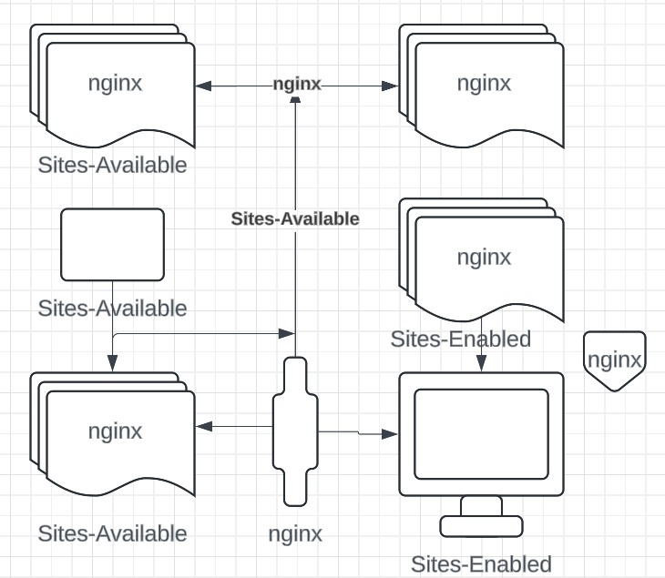

# 0x19. Postmortem


## Issue Summary
### Duration of the Outage:
The outage lasted from 11:45 AM to 12:45 PM West African Time (WAT).

### Impact:
The website was completely inaccessible to users, affecting 100% of the user base. The site was not responding due to the Nginx server not listening on port 80, leading to a full outage.

### Root Cause:
The root cause was a misconfiguration where the Nginx server's sites-available configuration was not linked to sites-enabled. Although the configuration was correct, it was not activated, resulting in the site being down.

## Timeline
- 11:45 AM: Issue detected when ALX attempted to access the website and found it unresponsive.
- 11:50 AM: ALX monitoring alerts escalated the issue.
- 11:55 AM: Initial investigation checked Nginx configuration files; no errors were found.
- 12:15 PM: Discovered that sites-available was not linked to sites-enabled, meaning Nginx was not listening on port 80.
- 12:30 PM: Linked the correct configuration and restarted Nginx to apply changes.
- 12:45 PM: Issue resolved, and the site was back online.
## Root Cause and Resolution
### Root Cause:
The root cause was the failure to link the configuration in sites-available to sites-enabled in Nginx. This oversight prevented the server from listening on port 80, causing the site to be unavailable.

### Resolution:
The issue was resolved by linking the configuration from sites-available to sites-enabled and restarting the Nginx service, which allowed the site to resume normal operation.

## Corrective and Preventative Measures
### Improvements:

- Automate the process of linking sites-available to sites-enabled after configuration changes.
- Enhance monitoring to detect configuration issues that prevent Nginx from listening on port 80.
### Task List:

1. Create and execute a script that automatically links sites-available to sites-enabled after any configuration change.
2. Add a monitoring check to ensure that Nginx is correctly listening on port 80.
## Example Script
Below is a script to ensure the configuration is always active:

```plaintext
#!/usr/bin/env bash
# Ensure Nginx is properly configured and listening on port 80

cat /etc/nginx/sites-available/default > /etc/nginx/sites-enabled/default
sudo service nginx restart
```
This script ensures that the correct configuration is enabled and restarts Nginx to apply the changes.

## Flow Diagram

